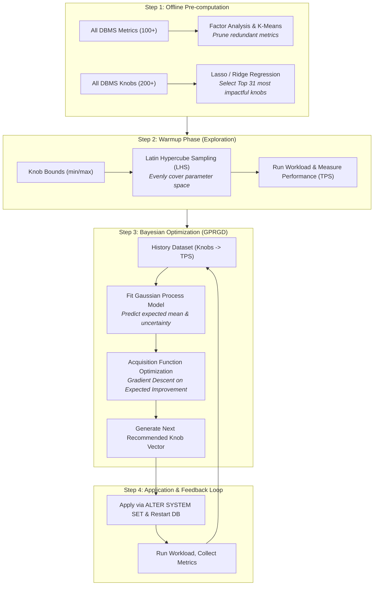

# How OtterTune Works Step-by-Step

This document explains the end-to-end process of how **OtterTune** generates recommended database configuration knobs to maximize database performance (throughput/latency).

---

## High-Level Architecture Overview

OtterTune frames database knob tuning as a **black-box Bayesian Optimization (BO)** problem with four distinct stages:



---

## Detailed Step-by-Step Breakdown

### Step 1: Knob & Metric Pruning (Dimensionality Reduction)
Modern databases (like PostgreSQL or MySQL) have over 200 knobs and hundreds of internal runtime counters (`pg_stat_database`, `pg_stat_bgwriter`). Tuning 200+ dimensions simultaneously causes the "curse of dimensionality".

1. **Metric Selection (K-Means Clustering):** 
   OtterTune uses Factor Analysis and K-Means clustering to eliminate duplicate/correlated metrics, keeping only a compact set of non-redundant system signals.
2. **Knob Ranking (Lasso / Ridge Feature Importance):**
   OtterTune ranks all database knobs by their sensitivity to performance changes and selects the top $K$ knobs (e.g., the top 31 knobs in `knob_catalog.json`).

---

### Step 2: Warmup Phase (Latin Hypercube Sampling — LHS)
Before the machine learning model can make intelligent predictions, it needs initial training data points across the multidimensional knob space.


1. **Latin Hypercube Sampling (LHS):**
   Instead of pure random sampling (which risks clustering in one corner of the space), LHS divides each knob dimension into equal intervals and samples such that each row and column contains exactly one sample.
2. **Execution:**
   OtterTune applies each LHS configuration to PostgreSQL, runs the workload, and records the pair:
   $$\text{Observation}_i = (\mathbf{x}_i, y_i) = (\text{Knobs}_i, \text{Throughput}_i)$$

---

### Step 3: Statistical Modeling (Gaussian Process Regression)
Once the warmup phase completes, OtterTune switches to the **Gaussian Process Regression (GPR)** surrogate model.

```
       Performance (y)
          ^
          |            .---. (True unknown objective)
          |           /     \
          |     *    /   *   \     *  <-- Sampled Points
          |      \__/     \___/
          |       |        |
          +-------+--------+----------> Knob Value (x)
             Uncertainty is low near samples,
             high in unexplored regions.
```

1. **Standardization:**
   Knobs ($\mathbf{X}$) and performance metrics ($y$) are scaled to zero-mean, unit-variance. OtterTune converts maximization of throughput into minimization of $-y$.
2. **Surrogate Modeling:**
   A Gaussian Process model with a Matérn / RBF kernel is trained on all historical observations. For any unseen configuration $\mathbf{x}$, the GP predicts:
   - **Mean prediction $\mu(\mathbf{x})$**: Expected throughput.
   - **Variance $\sigma^2(\mathbf{x})$**: Model uncertainty / confidence.

---

### Step 4: Acquisition Function & Gradient Descent (GPRGD)
To pick the single best configuration to try next, OtterTune balances **Exploitation** (picking areas where predicted mean is high) and **Exploration** (picking areas where uncertainty is high).

1. **Candidate Seeding:**
   OtterTune generates candidate starting points in the scaled space:
   - Uniform random samples.
   - Perturbed copies ($\pm \epsilon$) of the best historical configurations found so far.
2. **Gradient Descent on the GP Surface (GPRGD):**
   OtterTune uses TensorFlow to compute analytical gradients $\nabla_{\mathbf{x}} \text{Acquisition}(\mathbf{x})$ and runs gradient descent directly on the continuous GP surface starting from the candidate points.
3. **Recommendation Selection:**
   The point $\mathbf{x}^*$ that minimizes the acquisition function:
   $$\mathbf{x}^* = \arg\min_{\mathbf{x}} \left( \mu(\mathbf{x}) - \beta \cdot \sigma(\mathbf{x}) \right)$$
   is selected as the optimal recommendation.

---

### Step 5: Applying & Iterative Feedback
1. **Inverse Transformation & Clamping:**
   The normalized vector $\mathbf{x}^*$ is unscaled back into real units (e.g., `shared_buffers = 512MB`, `max_parallel_workers = 4`) and clamped within hardware boundaries.
2. **Database Application:**
   OtterTune executes `ALTER SYSTEM SET <knob> = <value>;` and restarts the database container if restart-required knobs were modified.
3. **Loop Update:**
   The workload is executed, the new performance $y^*$ is measured, and $(\mathbf{x}^*, y^*)$ is appended to the history dataset for the next iteration.

---

## Comparison: Warmup vs. GP-BO Iterations

| Phase | Method | Primary Objective | When It Runs |
| :--- | :--- | :--- | :--- |
| **Warmup** | Latin Hypercube Sampling (LHS) | Uniform space exploration | Iterations $1 \dots N_{\text{warmup}}$ |
| **Active Tuning** | Gaussian Process + Gradient Descent (GPRGD) | Model-driven exploitation & refinement | Iterations $N_{\text{warmup}} + 1 \dots N_{\text{total}}$ |
